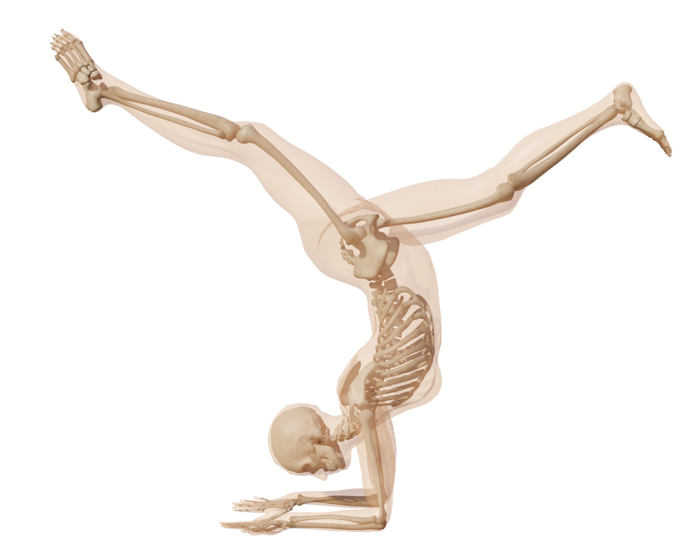
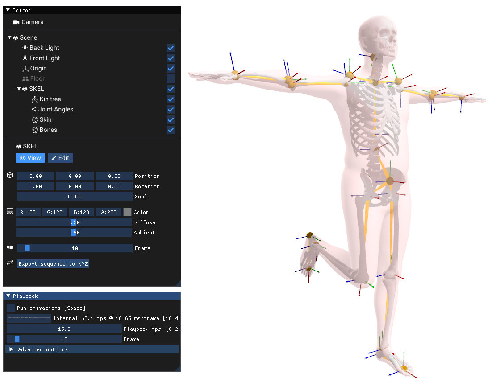
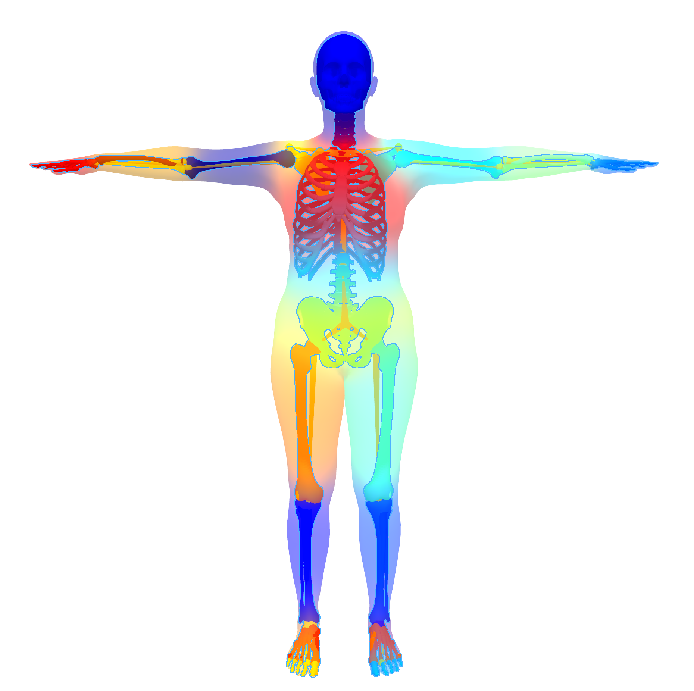
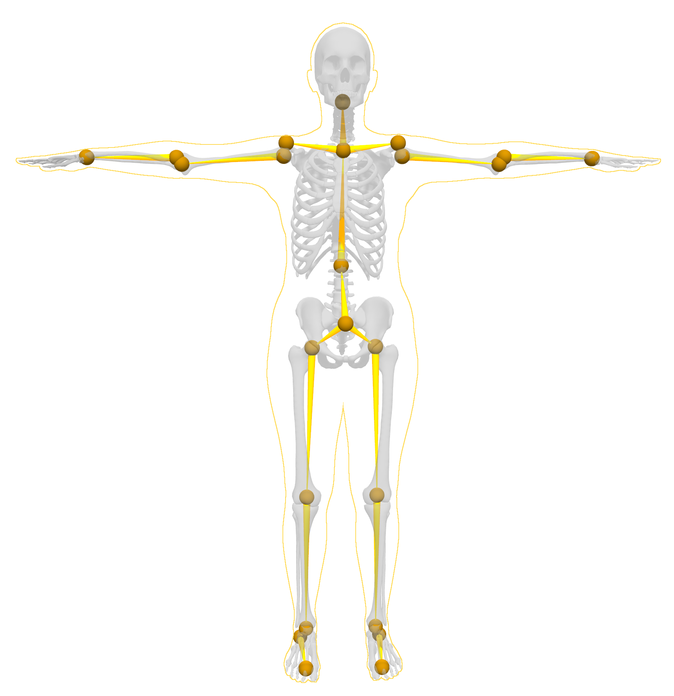

## SKEL



This repository is part of the code release for the Siggraph Asia 2023 paper "From Skin to Skeleton: Towards Biomechanically Accurate 3D Digital Humans". 

[[paper](https://download.is.tue.mpg.de/skel/main_paper.pdf)] [[project page](https://skel.is.tue.mpg.de/)]

This repo contains the pytorch SKEL loader and the code to align it to SMPL sequences.

SKEL is a parametric body shape and skeleton model. Its pose parameter lets you change the body shape and its pose parameter lets you pose the skeleton in an anatomically plausible way. Given shape and pose parameters, SKEL returns joint locations, a body mesh, and a skeleton mesh. SKEL is differentiable and can be fit to various data like motion capture or SMPL sequences.

For more information, please check our Siggraph 2023 paper: From Skin to Skeleton: Towards Biomechanically Accurate 3D Digital Humans.

## Table of Contents

- [Installation](#installation)
  - [Set up the environment](#set-up-the-environment)
  - [Downloading SKEL](#downloading-skel)
  - [Aitviewer](#aitviewer)
  - [SMPL and Mesh package](#smpl-and-mesh-package)
- [Demos](#demos)
  - [Pose parameters](#pose-parameters)
  - [Shape space](#shape-space)
  - [Rigging](#rigging)
  - [SKEL sequence](#skel-sequence)
  - [SKEL sequence](#skel-sequence)
  - [Aligning SKEL to SMPL sequences](#aligning-skel-to-smpl-sequences)
  - [Aligning SKEL's skin to another skeleton model joint locations](#aligning-skels-skin-to-another-skeleton-model-joint-locations)
- [Acknowledgments](#acknoledgments)
- [Citation](#citation)
- [License](#license)
- [Contact](#contact)

## Installation

### Set up the environment
Clone this repository

```
git clone https://github.com/MarilynKeller/SKEL
cd SKEL
```

Create a virtual environment and install the SKEL package
```
pip install -U pip   
python3.8 -m venv skel_venv
source skel_venv/bin/activate
pip install git+https://github.com/mattloper/chumpy 
pip install -e .
```

### Downloading SKEL
Create an account on https://skel.is.tue.mpg.de/ (Necessary for the download to work).

Then download the SKEL model from the download page with the "Download Models" button.
Extract the downloaded folder and edit the file `SKEL/skel/config.py` to specify the folder containing the downloaded SKEL model folder: `skel_folder = '/path/to/skel_models_v1.0`


To test the SKEL model, run:
``` 
python quickstart.py 
```
This runs the forward pass of SKEL and saves the output as separated body and skeleton meshes.


### Aitviewer

If you want to run the Demos, you will also need our aitviewer fork for visualization:

```
cd ..
git clone https://github.com/MarilynKeller/aitviewer-skel.git
cd aitviewer-skel 
pip install -e .
```

Edit then the file `aitviewer/aitviewer/aitvconfig.yaml` to point to the SKEL folder:

```skel_models: "/path/to/skel_models_v1.0"```

### SMPL and Mesh package
If you want to run an alignment to SMPL, you need to download the SMPL model.
First, create an account on https://smpl.is.tue.mpg.de/.
Then download this file: SMPL_python_v.1.1.0.zip from the download page. And run:

```
cd ../SKEL
python scripts/setup_smpl.py /path/to/SMPL_python_v.1.1.0.zip  
```

For visualizing the fitting process you need the MPI mesh package, you can install it with the following line:

```
pip install git+https://github.com/MPI-IS/mesh.git  
```
Note that the mesh package is only supported on Linux, but it is only necessary for the visualization of the fitting processes.

## Demos

### Pose parameters
Visualize the effects of the pose parameters of SKEL:

```
python examples/skel_poses.py --gender male
```




### Shape space
Vizualize the shape space:

```
python examples/skel_betas.py --gender female 
```

### Rigging
Visualize the skinning weights of the skin and bones to the SKEL kinematic tree:


```
python examples/skel_rigging.py --gender female  
```



Visualize the kinematic tree and joint locations of SKEL:

```
python examples/skel_kintree.py --gender female
```



### SKEL sequence
Visualize a SKEL sequence. You can find a sample SKEL motion in `skel_models_v1.0/sample_motion/ ` and the corresponding SMPL motion.

```
python examples/skel_sequence.py /path/to/skel_models_v1.x/sample_motion/01_01_poses_skel.pkl -z 
```

To visualize the SMPL sequence alongside : 
```
python examples/skel_sequence.py /path/to/skel_models_v1.0/sample_motion/01_01_poses_skel.pkl -z --smpl_seq /path/to/skel_models_v1.0/sample_motion/01_01_poses.npz
```

## Aligning SKEL to SMPL sequences

SKEL can be aligned to SMPL sequences. You can download SMPL sequences from the [AMASS](https://amass.is.tue.mpg.de/) Download page, and selecting the `SMPL+H G` sequences.

Here is the command to run the alignment:
```
python examples/align_to_SMPL.py /path/to/AMASS/CMU/01/01_01_poses.npz -F 
```

## Aligning SKEL's skin to another skeleton model joint locations

If you have another skeleton model, you can define the mapping between your skeleton model joints and SKEL's joint and optimize SKEL.shape and pose in consequence to obtain a skin mesh that fits your skeleton model.

```
python examples/fit2joints.py 
```

## Acknoledgments
This research was done partly at [The Movement Lab](https://tml.stanford.edu/) in Stanford and [Perceiving Systems](https://ps.is.mpg.de/) at the Max Planck Institute for Intelligent Systems.

We thank Neelay Shah for generating all the necessary SMPL fits, A. A. Osman for his expertise on parametric body models, Shashank Tripathi for his help with MOYO, Giorgio Becherini for his expertise on AMASS and mocap fit evaluation, Peter Kultis, Yao Feng and Yuliang Xu for feedbacks on the paper.
We also thank the TML lab and the NMBL lab at Stanford for the fruitful discussions, especially Jennifer Maier for her expertise on the shoulder.

## Citation
If you use this software, please cite the following work and software:

```
@inproceedings{keller2023skel,
  title = {From Skin to Skeleton: Towards Biomechanically Accurate 3D Digital Humans},
  author = {Keller, Marilyn and Werling, Keenon and Shin, Soyong and Delp, Scott and 
            Pujades, Sergi and C. Karen, Liu and Black, Michael J.},
  booktitle = {ACM ToG, Proc.~SIGGRAPH Asia},
  volume = {42},
  number = {6},
  month = dec,
  year = {2023},
}
```

### License

This code and model are available for non-commercial scientific research purposes as defined in the [LICENSE.txt](LICENSE.txt) file.


## Contact 

For any questions about SKEL loading, please contact skel@tuebingen.mpg.de.

For commercial licensing, please contact ps-licensing@tue.mpg.de
